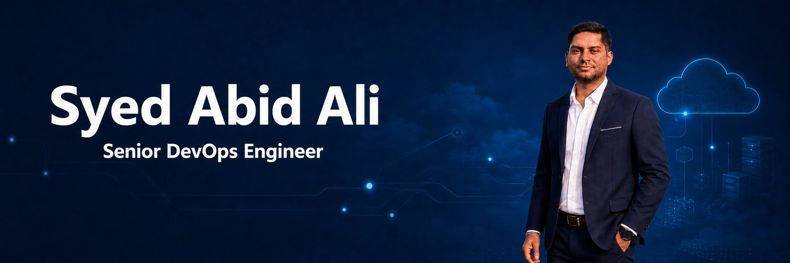

  
  
  
  

---

## About Me

Senior Azure Cloud & DevOps Engineer with **13+ years of IT experience**, including **6+ years specializing in Azure Cloud Infrastructure and DevOps**. Experienced in delivering secure, scalable, and resilient Azure solutions aligned with Microsoft CAF and DevSecOps best practices.

- **Current focus:** Azure Landing Zones, reusable Terraform modules, and production-grade CI/CD automation
- **Core expertise:** Azure infrastructure, Terraform, Azure DevOps, GitHub Actions, Linux, networking, security, monitoring, backup, and disaster recovery
- **Engineering approach:** Repeatable infrastructure, controlled releases, least-privilege access, proactive monitoring, and operational reliability

---

## Technical Ecosystem

- **Azure Cloud Architecture:** Azure Landing Zones, Management Groups, Subscriptions, Hub-Spoke Network Architecture, VNets, Subnets, VNet Peering, NSGs, UDRs, Azure Firewall, Bastion, NAT Gateway, Load Balancer, Application Gateway (WAF), VMs, VMSS, and Storage Accounts.

- **Infrastructure as Code (IaC):** Terraform (reusable modules, remote backends, state locking, workspaces, import, drift detection, and state management).

- **CI/CD & Automation:** Azure DevOps and GitHub Actions (multi-stage YAML-based pipelines, environments, security scanning, validation, build, test, approval gates, and automated deployments).

- **Identity & Security:** Microsoft Entra ID, RBAC, MFA, PIM, Managed Identities, Service Principals, Azure Policy, Key Vault, and OIDC/Workload Identity Federation.

- **DevSecOps:** TFLint, tfsec, Checkov, GitLeaks, TruffleHog, and Infracost integrated into CI/CD pipelines for quality and security controls.

- **Monitoring & FinOps:** Azure Monitor, Log Analytics, dashboards, alerts, operational visibility, Azure Cost Management, and optimization.

- **Business Continuity:** Azure Backup, Recovery Services Vault, Azure Site Recovery, recovery planning, and RTO/RPO-driven disaster recovery.

- **Version Control:** Git, GitHub, Azure Repos, trunk-based development, pull requests, code review, and branching strategies.

---

## Microsoft Certifications

| Certification | Code | Status |
|---|:---:|:---:|
| Microsoft Certified: Azure Administrator Associate | **AZ-104** | Preparing |
| Microsoft Certified: DevOps Engineer Expert | **AZ-400** | Preparing |

---

## Featured Engineering Work

<strong>Azure Landing Zone — CAF & Terraform</strong>

- Deployed Azure Landing Zone components aligned with Microsoft Cloud Adoption Framework principles.
- Automated Hub-Spoke networking, VNet peering, Azure Firewall, Bastion, and Key Vault using reusable Terraform modules.
- Standardized infrastructure provisioning across development, UAT, and production environments.

<strong>End-to-End DevSecOps Pipelines</strong>

- Built multi-stage Azure DevOps and GitHub Actions pipelines with validation, security scanning, artifacts, approval gates, and controlled production releases.
- Implemented deployment health validation, including `/healthz` checks, to reduce release risk.
- Integrated TFLint, Checkov, tfsec, GitLeaks, TruffleHog, and Infracost into infrastructure workflows.

<strong>Backup, Disaster Recovery & Operational Resilience</strong>

- Implemented Azure Backup and Azure Site Recovery for business-critical workloads.
- Performed test failovers, recovery validation, cleanup, and RTO/RPO readiness checks.
- Configured Azure Monitor and Log Analytics for centralized monitoring, alerting, and troubleshooting.

---

## GitHub Insights

---

## Connect

Open to conversations about **Azure Cloud Infrastructure, Terraform, CI/CD automation, DevOps, and SRE opportunities**.

  
  
  

Azure Cloud · Infrastructure as Code · DevOps Automation · Reliability Engineering

